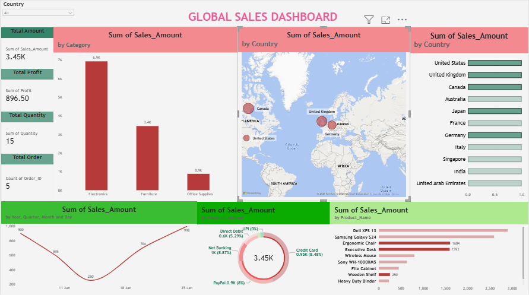

# Global-Sales-PowerBI-Dashboard
# 📊 Global Sales Interactive Power BI Dashboard

## 🚀 Overview
An interactive Power BI dashboard designed to track global sales performance, profit margins, regional trends, and category distribution.

## 📷 Dashboard Preview

## Key Features & Insights
- **KPI Cards:** Total Sales, Total Profit, Total Quantity, and Total Orders.
- **Visuals:** Category-wise sales, Country-wise distribution, Monthly Sales Trend, and Payment Methods.
- **Interactivity:** Top dropdown slicer for filtering data by Country/Segment.

## 📁 Repository Contents
- `Global_Sales_Dashboard.pbix` - Power BI Source File
- `Sales_Data.xlsx` - Dataset used for analysis
- `dashboard_preview.png` - Dashboard Screenshot
